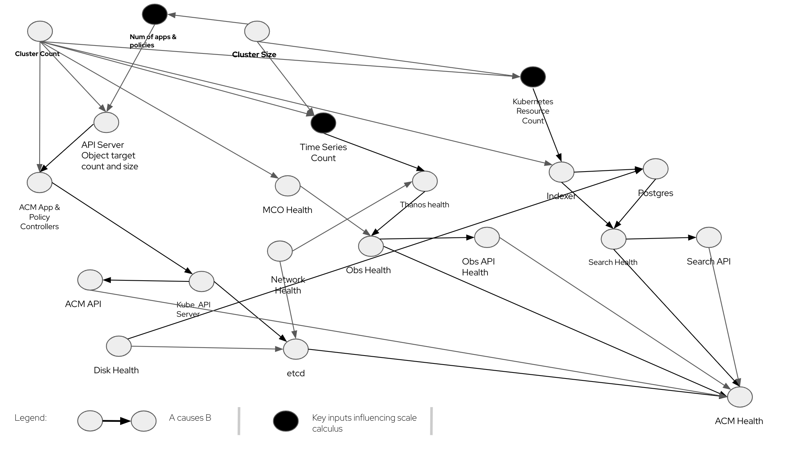

# ACM Capacity-planning
Our goal is to help to create capacity recommendations for ACM and capacity recommendations for ACM Observability only.
Needs for capacity planning varies greatly. It depends on the scenario as explained below:

||Setup|Action|Red Hat recommends
|---|---|---|---|
|1.|Existing (brown-field) set up: ACM hub is running with real clusters being managed under it| Use [ACM Inspector](https://github.com/bjoydeep/acm-inspector) to extract data out of the system.|ACM team can recommend based on this output and number of clusters the hub will have to manage etc. This is a fairly quick `manual` process for a now - a tool will be shortly published.|
|2.|No ACM running (green-field) but clusters that would be managed exists| Use [Metrics Extractor](https://github.com/stolostron/multicluster-observability-operator/tree/main/tools/simulator/metrics-collector/metrics-extractor) to extract the metrics out of the system. Use [Search resource extractor](https://github.com/stolostron/search-v2-operator/blob/main/tools/resource-extractor.sh) to extract the search objects that would be collected.| ACM team can size Observability & Search & ACM management needs based on this data and number of clusters it will manage etc. Observability sizings can be done using this data and [this notebook](./calculation/ObsSizingTemplateGivenTimeSeriesCount.ipynb). We are working on a similar tool for search.|
|3.|No ACM running (green-field) and clusters that would be managed do not exist| Proceed to read below.| This the most complex case of all.|

# ACM Domain Knowledge

 Below is a causal diagram of ACM from standpoint of scalability. This is definitely `not a full complete ACM Causal diagram`. That would be much more complex. Let us take a moment to review this figure and get the key idea behind this.

The big black dots are key drivers of ACM sizing along with the number of clusters it is managing. In other words, if we know the :
- Num of apps & policies (ie how many applications and policies are defined on the cluster) and this depends on the cluster size. For the sake of brevity this node represents both applications and policies. So this works if there is only applications, or only policies or both. 
- Time series count (depends on how large the cluster is and what kind of work is running on them)
- Resoure count (depends on how large the cluster is and what kind of work is running on them)
ACM scaling model is `conditionally independent of the real cluster size`. Ofcourse the number of clusters is still important. You could appreciate that given this model, when we do real performance measurement, we can simulate/create a number of clusters with any size (could be kind cluster, could be Single Node OpenShift clusters) than clusters of specific sizes. It is much simpler to do the former instead of the latter.

So, to trace one line of the flow end to end:
`Num of apps & policies` drives the `API Server Object target count and size` which in turn drives load on the `ACM App & Policy Controllers`. The `ACM App & Policy Controllers` are also influenced by the `Cluster Count` - ie number of clusters - into which the applications and policies these have to be replicated to. These in turn creates resources on the `Kube API Server`. These resources are created in `etcd`. Therefore etcd health is one of the key drivers of `ACM Health`. And `etcd` health is also dependent on `Network health` and `Disk health`.

This helps us to understand the data needed to determine the ACM Hub Cluster size.

## ACM Observability Sizing

### Inputs Needed
We need the following information to calculate the resources required to run Observability on top of ACM.

#### Either

1. number_of_managed_clusters: say 100
1. number_of_master_node_in_hub_cluster: say 3
1. number_of_addn_worker_nodes: say 47 and we assume these are above the base number: 3
1. number_of_vcore_per_node: say 16
1. number_of_application_pods_per_node: say 20. This is for the application and not ACM/Openshift workload.
1. number_of_namespaces: say 20. These are namespaces that will be created by the customer outside what is created by ACM/Openshift workload.
1. number_of_container_per_pod:1. Do not change this as of now.
1. number_of_samples_per_hour:12. This means metric will be sent every 5 min.
1. number_of_hours_pv_retention_hrs:24. This means that data will retained in PV for 24 hrs which is standard. Do not reduce this number for production systems.
1. number_of_days_for_storage:365. This the amount of days of retention in the object store.

#### Or
1. Number of timeseries from Setup #2 above
1. number_of_samples_per_hour:12. This means metric will be sent every 5 min.
1. number_of_hours_pv_retention_hrs:24. This means that data will retained in PV for 24 hrs which is standard. Do not reduce this number for production systems.
1. number_of_days_for_storage:365. This the amount of days of retention in the object store.

### Methodology of Calculation
1. First, we have to calculate how many time series will we need to persist. This is calculated in 2 steps.
    1. Calculated Number of time series for Base 3M+3W deployment for a Cluster (based on lab data)
    1. Calcluated Number of Time series for Additional Worker Nodes
1. Then from total number of time series, we infer
    1. Memory requirement (2 hours of this time series data is stored in memory)
    1. CPU Requirement (this is a little weak at the moment. We have not seen too much dependency on CPU yet so we have not focussed too much on it)
    1. Disk needed for PVs (volume of data stored is dictated by settings in MultiCluster Observability CR)
    1. Storage needed for Object store (volume of data stored is dictated by settings in MultiCluster Observability CR)

### Calculator
- Use this [pythonNotebook](/calculation/ObsSizingTemplate.ipynb).
- Substitute the values in the notebook under section:
`Critical Input Parameters to Size` with values described above.
- Then run the notebook. It will produce the recommendations.
## ACM Sizing
We need the following information to calculate the resources required to run ACM. Observability sizing is `not` included here.

### Inputs Needed

1. managed_clusters: say 500
1. nos_of_worker_nodes_per_cluster: say 40 
1. nos_of_pods_per_cluster: say 5000
1. nos_of_namespace: say 200
1. nos_of_apps_per_cluster_distributed_by_hub: say 10. This implies ACM App life cycle is being used.
1. nos_of_policies_per_cluster: say 30
1. nos_of_acm_hub: say 10. We will assume the clusters to be distributed evenly across the hubs for sizing.

### Methodology of calculation
Each managed cluster using ACM applications and policies created on it creates corresponding objects on the Kubernetes APIServer of the ACM hub. As the number of managed cluster and corresponding applications and policies grow, the load on the Kubernetes APIServer increases. There is a finite limit on how big this footprint on APIServer can be - this is mainly governed by the size of ETCD database backing the APIServer.

1. Check if the specified load profile is in danger of crossing this limit. That will merit more than 1 ACM hub
1. Check if the specified load profile merits a highly performant etcd system backed ie backed by NVMe disks
1. If topology of Hub Server is 3M+3W, check for corresponding data samples to size/project.
1. If topology of Hub Server is 3M, check for corresponding data samples to size/project.

### Calculator
This is manual as of now. Please reach out the RHACM Engineering team for this.
